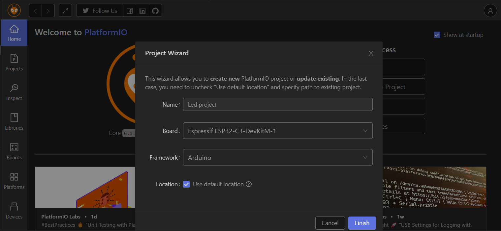
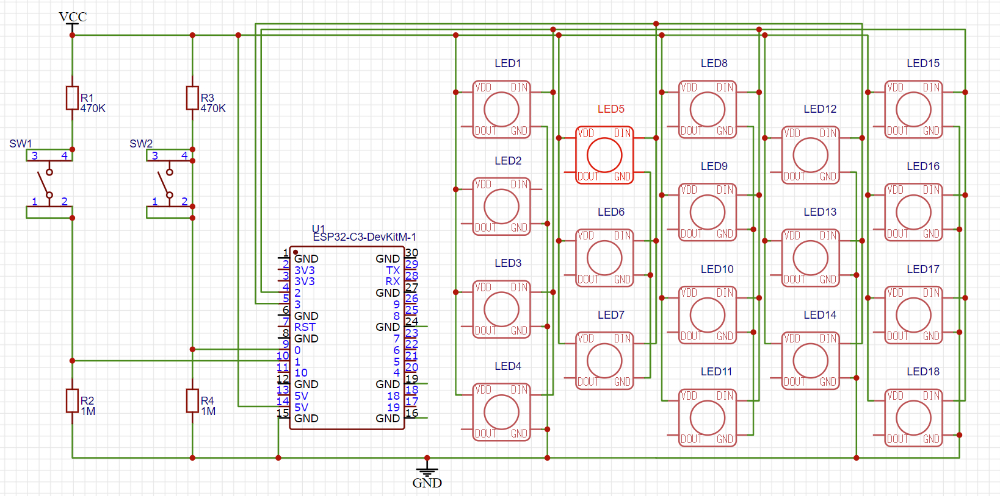
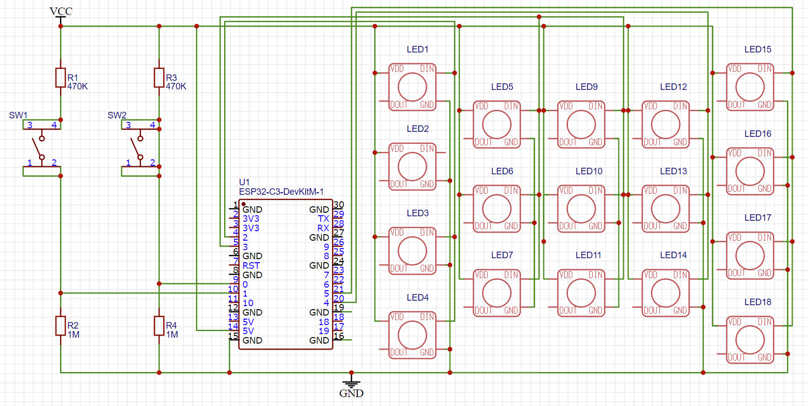
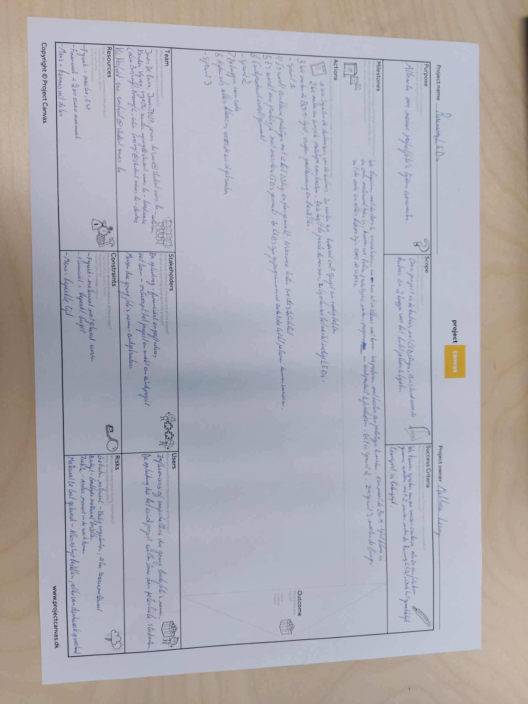
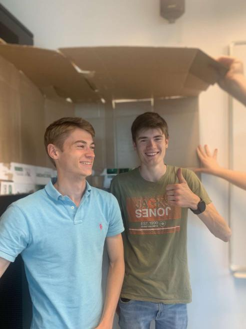
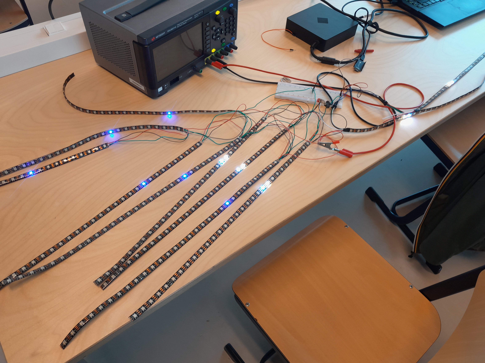
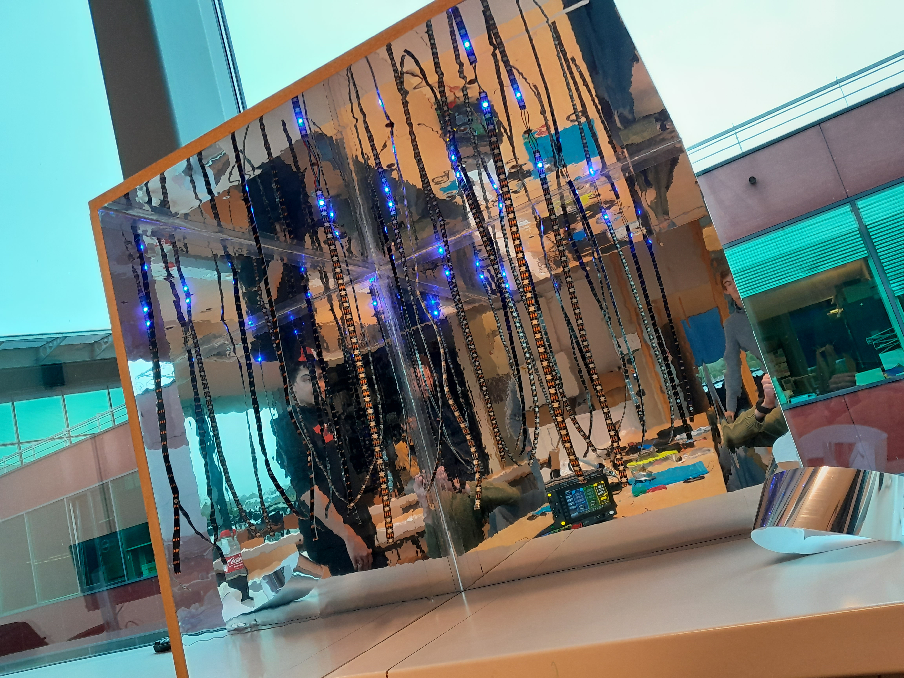

# RainingLEDs
<h1 id="What">What?</h1>

The RainingLEDs project is a project that contains a cool and unique photo location. It's made for all ages, but more focussed on influencers and social media users. Our project consists of a box with mirror foil and 17 LEDstrips, creating an infinite rain illusion. Important to know is that this project is a proof of concept that can help making a bigger version that has yet to be made (see chapter 'Project Expansion'). 

<h1 id="how">How does it work?</h1>

The 17 LED-strips are controlled by an ESP32-C3 microcontroller. That sends signals to the strips to recreate a handful of patterns. At the side of the box the vistors can push on 2 different buttons which put the LEDs in different modes.

<h1 id="require">Requirements</h1>
<ul>
    <li>Materials:</li>
    <ul>
        <li>+/- 10 meters of BTF-LIGHTING WS2814 12V LED-strips</li>
        <li>3 wooden mbf plates making a cube from 70 X 70 X 71.8 cm</li>
        <li>Mirror foil for each side</li>
        <li>ESP32-C3-DevKitM-1 microcontroller</li>
        <li>2 buttons</li>
    </ul>
    <li>Software:</li>
    <ul>
    <li>Coded in C++ using the Adafruit_NeoPixel library. Follow the next steps to download the library (in Visual Studio Code).
    First you'll need to download the PlatformIO extension. Go to 'PIO Home' and select 'New Project'. Use the following settings in the next window:
    
    Now we just need to implement the Adafruit_NeoPixel.h library into our project (included inside the main.cpp file). You can simply do this by searching the Adafruit Neopixel library in the Libraries menu (at the left side in PIO Home). You should now be able to use the code on the ESP32 by building it and uploading it!
    </li>
    </ul>
</ul>
<h1>Project Expansion</h1>
As stated before, this project is a proof of concept, which is the base for a possible expansion as a bigger (human-size) box. In this chapter you'll find all documentation and things we noticed that can be helpfull for this.
<h2>Box</h2>
<ul>
<li>
Our box is in fact too small to take a picture of a full person. This makes is easy to replace, but is also a disadvantage since the effects would be more spectacular on a human-size box. So a bigger box should be one of the primary improvements this project needs. 
</li>
<li>
For the wood, we used mbf plates. This is a strong type of wood that can easily be drilled into, so perfect for our project. We used mirror foil, but it should be strong enough to carry real mirrors. Keep in mind this will make it a heavy construction, so replacing it wont be an option in that case.
</li>
<li>
As stated before, we didn't use real mirrors but a foil. Because the LEDs are hanging in front of it, it almost gives the same effect as a real mirror. So this is something we could recommend!
</li>
</ul>
<h2>LEDstrips</h2>
We used 17 LEDstrips from +/- 50 cm. The only problem with this is that the strips are one-sided, so they are either facing the mirrors or the audience. This makes the effect come out less, so double LED strips would be better. For this, a few things have to be known:
<ul>
<li>
<h3>Power supply</h3>
</li>
</ul>
<h1>Troubleshooting</h1>
<h2>LEDstrips</h2>
We had to resolder a few LEDstrips because the cables were detached while we were putting them in the box. When all the LEDs were in place we located 2 strips cause they stopped functioning and replaced them by 2 smaller strips.
<h2>Coding</h2>
We started with coding some simple functions to test the LEDs. After that we extended the LEDstrip to see if it would still work with the ESP32. We encountered a problem with some code examples where the LEDs would not follow the code and would simply show random colours. When the voltage was adapted to the right value, it started working again with a larger LEDstrip.
<h2>Power supply</h2>
We began with following the datasheet, so we used a voltage of 3.6 with a school power supply. Because we were working with a voltage of 3.6 we had to consider to limit our brightness so we wouldn't take up a whole lot of wattage. We concluded that the ideal brightness for the LEDs was 60%. This also made sure that the functions worked properly. When we rearranged the wiring of our project, we made it work to use our own power supply with 5V.   
<h2>Button</h2>
The buttons were implemented fairly quickly. 
But we ran into some problems: they only worked with static functions, not with dynamic patterns and a delay occured when pushed. We solved the delay problem by adding a debounce system that ensured that only one button press is registered. By working with threads we managed to cycle between dynamic functions.
<h1 id="image">Images</h1>
<h2>Electric schematic</h2>  

<h2>Final electric schematic</h2> 

<figcaption>The Electric schematic shows into detail how all the LEDs are connected to the ESP32 microcontroller.</figcaption>
<h2>Projectcanvas</h2>

<figcaption>The projectcanvas shows the different aspects of the project. It was the first plan of the project and contains things like the tasks that need to be done and the stakeholders.</figcaption>
<h2>Prototype 1</h2>

<figcaption>This is the first, very simply, prototype. The main goal was to see how big the box has to be and how many LEDs we need.</figcaption>
<h2>Testing LEDstrips</h2>

<figcaption>Before we started building the box, we tested the LEDstrips to see if they all worked.</figcaption>
<h2>Final box</h2>

<figcaption>The final box, including the working LEDstrips.</figcaption>
<h1 id="members">Team members</h1>

This project was developed by VIVES students Jonas De Rous, Xander Vyvey, Colin Bossuyt and Vic Verbiest in 2023.

