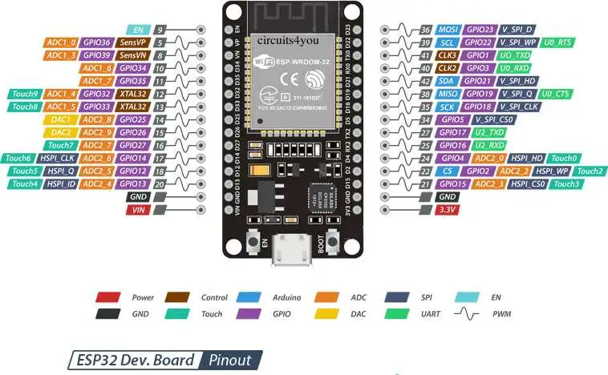

# RainingLEDs
</img>
<h1 id="What">What?</h1>
    
The RainingLEDs project is a project that contains a cool and unique photo location. It's made for all ages, but more focussed on influencers and social media users. Our project consists of a box with mirror foil and 17 LEDstrips, creating an infinite rain illusion. Important to know is that this project is a proof of concept that can help making a bigger version that has yet to be made (see chapter 'Project Expansion'). 

<h1 id="how">How does it work?</h1>
    
The 17 LED-strips are controlled by an ESP32-C3 microcontroller. That sends signals to the strips to recreate a handful of patterns. At the side of the box the vistors can push on 2 different buttons which put the LEDs in different modes.

<H1>Hardware</H1>
    The "hardware" of the project is described in this chapter.
<h2 id="require">Hardware Requirements</h2>
    <ul>
        <li>+/- 10 meters of sk6812 rgwb LED-strips</li>
        <li>3 wooden mbf plates making a cube from 70 X 70 X 71.8 cm</li>
        <li>Mirror foil for each side</li>
        <li>ESP32-C3-DevKitM-1 microcontroller</li>
        <li>2 buttons</li>
    </ul>
</ul>
<h2>Box</h2>
    For building the box, we used MBF plates. These are strong wooden plates that can easily be drilled into. The inside of the box has the dimension 70cm x 70cm x 70cm. This is the space where someone can stand in when they want to take a picture. On the inside, we used mirror foil to  create the illusion of a bigger number of leds. The buttons are placed ad the bottom side for easy acces when taking a picture. 

<h2>LEDstrips</h2>
    In the current project, we use 17 led strip who are each +/- 50 cm. This is a good length for the current height of the box (70 cm), and by this way we didn't need an extra 5m led strip just to use 20% of it. To know if using 17 led strips works, we first tested it by using 2 data pins to control all the LEDstrips:
    
    Since this worked, we installed the LEDs in the box and connected everything together on top. Because of the drilled holes in the top plate, installing the LEDstrips was easy. We used a breadboard to make all the connections with the esp32. This way, we could easily change the wiring if needed. Here are some things that can be improved about the lighting (additional info can be found in the 'Project Expansion' chapter):
<ul>
    <li>
        In this project, all LEDstrips hang on their own. This means that the side where LEDs are, are faced to the public or to the mirrors on the inside. They are never facing both. This is not a big problem but interferes with the illusion of the mirrors. This problem could be solved by putting 2 led strip, back to back,instead of hanging them alone.
    </li>
    <li>
        Each led strip is connected directly to the esp32. This means that there is maximum 3.3V on the data pin when sending a high signal. This can be the reason why the leds are not always working as intended. This can be solved by using a transistor or a mosfet to amplify the signal. 
    </li>
</ul>
<h1>Software</h1>
    <h2>Adafruit_NeoPixel library</H2>
        This project was coded in C++ using the Adafruit_NeoPixel library. Follow the next steps to download the library (in Visual Studio Code).
        First you'll need to download the PlatformIO extension. Go to 'PIO Home' and select 'New Project'. Use the following settings in the next window:
        
        Now we just need to implement the Adafruit_NeoPixel.h library into our project (included inside the main.cpp file). You can simply do this by searching the Adafruit Neopixel library in the Libraries menu (at the left side in PIO Home). You should now be able to use the code on the ESP32 by building it and uploading it!
    <h2>main.cpp</h2>
        In the main programfile for the project, there are 3 crusial parts:
        <ul>
            <li>
                <h3>Buttons</h3>
                The buttons are programed to be triggered on the positive flank. This means that when the button is going from a low state to a high, the program will interpret at that as a button press. This means that nothing will happen when someone releases the button ore hold it. To reduce the dender, there is a delay programmed to filter only one positive flank.
            </li>
            <li>
                <h3>Cycle</h3>
                The cycle is the part of the program that is responsible for changing the pattern. When a button is pressed, the cycle will change to the next pattern. This is done by using an array witch include all patterns  whereof the index, which is used to filter the correct data, is increased or decreased. When the index is bigger than the array, the index will be set to 0. When the index is smaller than 0, the index will be set to the last index of the array.
            </li>
            <li>
                <h3>Sending data</h3>
                To send the data to the ledstrips, the correct data has to be filtert. This is done by useing a series of if-statements wich check of the data in the array from above. when the correct data is found, the data will be send to the ledstrips. This is done by using the Adafruit_NeoPixel library. This library has a function called 'show()' witch will send the data to the ledstrips.since there are  data pins, the sended data looks like this:
                
            </li>
        </ul>
    <h2>Effects</h2>
    There are 7 different effects that can be cycled through:
    <ul>
    <li><b>Rain:</b></li> The rain effect shows rain drips from 4 leds long in a blue color. Eacht datapin has a delay so the drips are falling irregular.
    <li><b>Wave fade:</b></li> The wave fade effect shows a blue wave in the LEDs.
    <li><b>Blinking star light:</b></li> This effect shows star light that go on and off in a white color.
    <li><b>Sunrise:</b></li> Sunset colors are slowly waving on the LEDstrips.
    <li><b>Ripple:</b></li> The LEDs are juming up and down.
    <li><b>Fire:</b></li> A red/orange color is showed, it slightly changes which makes it looks like fire.
    <li><b>Breathing:</b></li> The LEDs are slowly changing from color in a pace that looks like breathing.
    </ul>
    <h2>MQTT</h2>
    The project also has an MQTT interaction with Project Master:    
       
    There are 4 topic that can be send to the MQTT broker:
    <ul>
    <li>
    <b>Command:</b> </li> With the command-topic, on and off can be sent to the ESP. When sending 'ON', all LEDstrips will show the first effect. When sending 'OFF', all LEDs will go out.
    <li><b>Rgbw:</b></li> The rgbw-topic needs 4 values and will show that specific color on all LEDstrips.
    <li><b>Brightness</b></li> With the brightness command, the brightness -what a surprise- from the current effect (or color sent by MQTT) will be adjusted.
    <li><b>Effect</b></li> The effect topic shows the slected effect from 7 possible effects.
    </ul>
<h1>Project Expansion</h1>
    Because this project is a proof of concept, there was expected from us to make a project that can be expanded. This means that the project can be used as a base for a bigger project. Here are some ideas that can be used to expand it and an elaborated vision of what this could become.
    <h2>Ideas (more details below)</h2>
        <ul>
            <li>double ledstrips</li>
            <li>bigger box</li>
            <li>use of transistors for data transmission</li>
            <li>using 'real' mirrors</li>
            <li>bigger microcontroller</li>
            <li>PCB</li>
            <li>...</li>
        </ul>
    <h2>Our vision</h2>
    As you can see up here, there are a lot of things one can do to make this a incredible project expansion. Under here, we will explain the ideas we think are the most important to make this project a succes. Here is our vision of what this project could become.
    <h3>Box</h3>
    <ul>
        <li>
            <h3>Dimensions</h3>
            Our box is in fact too small to take a picture of a full person. This makes it easy to replace, but it's also a disadvantage since the effects would be more spectacular on a human-size box. So a bigger box should be one of the primary improvements this project needs. We think it would be a good thing if a whole person could stand between the hanging ledstrips. This means that the box has to be at least 2 meters high. It would also be a good thing if the width of the box is a little bit bigger. This way, the illusion of the mirrors would be better because there could be more ledstrips and there could be place for multiple persons.   
               
            We think the dimensions of 100cm x 100cm x 200cm would be a good size for the box. This way, there is enough space for at least 3 people. If you want to be the project mobile, a possibility of splitting the side panels in 2 using hinges(so you create a 100 X 100 X 100 cm box) could be an option. This way, the box can be transported in a car. 
        </li>
        <li>
            <h3>Mirrors</h3>
            To create the effect that we want, the top and sides of the inside of the box has to be reflective. The best thing to use for this would be -of course- mirrors. In the prototype, we did not use real mirrors because of the expensive price. Another reason we didn't chose real mirrors is the fact that the ledsstrips have to come through the top, this would be very hard to do. Drilling holes in a mirror is a difficult proces and will result in a huge money loss if it goes wrong. So for the top part, we would stick to the mirror foil. For the side parts, real mirrors could be considered. While the mirror foil is a cheap and easy way to create the wanted effect, it is not as good as a real mirror. The mirror foil is not as reflective as a real mirror, so the effect is less spectacular.
        </li>
    </ul>
    <h3>LEDstrips</h3>
        When the box becomes bigger, it is normal that the number and length of the ledstrips will increase too. If we want to make a box as described above, a number of 25 ledstrips hanging from above would be perfect in our vision. Since we wanted to double the ledstips for the mirror effect (see chapter Hardware), this would come down on 50 ledstrips. When we make each of them 150 cm long, that would mean that there would be 75 meters of ledstrips. This would come down on 277 euro with the type of leds we are currently using.
        
        This would be a good placment of the ledstrips. With the staggered placement, the mirrors will reflect as much of the light as possible resulting in a beautiful photo.
    <h3>Electronics</h3>
    <ul>
        <li>
            <h3>Microcontroller</h3>
                The best way to control all ledstrips is when every LEDstrip has its own data pin. This way it is possible for every LEDstrip to do somthing completely different, which would result in no boundaries for patterns. In the current project, we used an ESP32-C3-DevKitC-02.
                
                This microcontroler has 15 GPIO ports. this is enough for the prototype but not for an expanded version with 25 double LEDstrips. And if we want to keep the two cycle buttons, we would need 27. A good solution would be the ESP32-WROOM-32. This microcontroler has 38 GPIO ports. This would be enough for the expanded version and would give us the possibility to add more buttons or other components.
                  
                
        </li>
        <li>
            <h3>Powersupply</h3>
                With 50 ledstrips, the power consumption will of course be a lot higher. This means that the power supply has to be more powerfull. When we use 50 ledstrips, the max powerconsumption would be around 30 Watt. The project would have to be connected to a 5V 6A power supply like the LHA30F-5-SNY:   
                
        </li>
        <li>
            <h3>PCB</h3>
        </li>
        To connect all LEDstrips, buttons and other components to the microcontroller, a PCB could be made. In our case, we placed a breadboard on top of the box that connects all components, which makes it easier to see what all our connections and components are when the project will be expanded.
        <li>
            <h3>Data transmission</h3>
        </li>
        To make sure the data transmission from the microcontroller to the LEDstrips goes well, transistors could be used. Since in our case the ESP needs 3.3V and the LEDs 5V, data conflicts could be possible. We sometimes experienced this in the from of LEDs showing colors that weren't meant to be showed or flickering LEDs when adjusting the brightness. But since we could fix most of them in the software, we didn't implement transistors in our case. Another option is to use a logic level converter between the ESP32 and LEDs: 
          
        
    </ul>
    

<h1 id="troubleshooting">Troubleshooting & problems</h1>
<h2>LEDstrips</h2>
We had to re-solder a few LEDstrips because the cables were detached while we were putting them in the box. When all the LEDs were in place we noticed that 2 strips stopped functioning and replaced them by 2 smaller strips.
<h2>Coding</h2>
We started coding some simple functions to test the LEDs. After that we extended the LEDstrip to see if it would still work with the ESP32. We encountered a problem with some code examples where the LEDs would not follow the code and would simply show random colours. When the voltage was adapted to the right value, it started working again with a larger LEDstrip. This was all done with one data line, however we wanted to use mutiple data lines to create a more natural flow between the LEDstrips so that there would be some variation. This worked with four data lines but only one pattern at a time. We still had some problems with cycling between dynamic patterns with multiple data lines.
<h2>Power supply</h2>
We began with following the datasheet, so we used a voltage of 3.6 with a school power supply. Because we were working with a voltage of 3.6 we had to consider to limit our brightness so we wouldn't take up a whole lot of wattage. We concluded that the ideal brightness for the LEDs was 60%. This also made sure that the functions worked properly. When we rearranged the wiring of our project, we made it work using our own power supply with 5V.
<h2>Buttons</h2>
The buttons were implemented fairly quickly, but we ran into some problems: they only worked with static functions, not with dynamic patterns and a delay occured when pushed. We solved the delay problem by adding a debounce system that ensured that only one button press is registered. By working with threads we managed to cycle between dynamic functions.
<h1 id="image">Additional Images</h1>
<h2>Electric schematic</h2> 
First, we wanted to make a Led cube using 2 data pins and 2 buttons. Because of the 2 data pins, we could send 2 different patterns to the LED-strips witch could make the illusion of falling rain or other dynamic patterns. The initial electric schematic looked like this:

When we slowly progressed on the project, we noticed that the difference between 2 and 4 data pins was not that big. With 4 data pins, there is a grated variety and freedom in the patterns we can create. There are still 2 buttons to cycle between the patterns. The final electrical schematic looks like this:

<figcaption>The Electric schematic shows into detail how all the LEDs are connected to the ESP32 microcontroller.</figcaption>
<h2>Projectcanvas</h2>

<figcaption>The projectcanvas shows the different aspects of the project. It was the first plan of the project and contains things like the tasks that needed to be done and the stakeholders.</figcaption>
<h2>Prototype 1</h2>

<figcaption>This is the first, very simply, prototype. The main goal was to see how big the box has to be and how many LEDs we need.</figcaption>
<h1 id="members">Team members</h1>

This project was developed by VIVES students Jonas De Rous, Xander Vyvey, Colin Bossuyt and Vic Verbiest in 2023.
  
More questions? You can contact us here: xander.vyvey@student.vives.be

